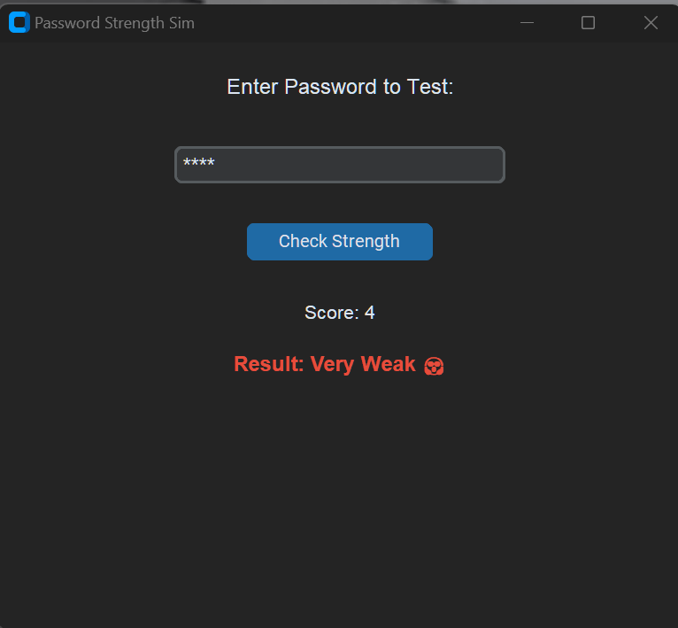
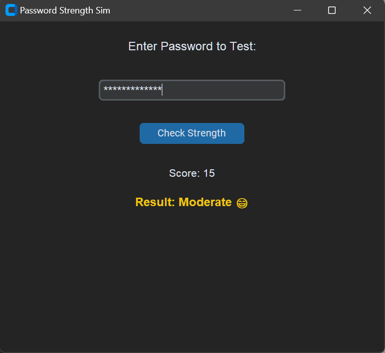
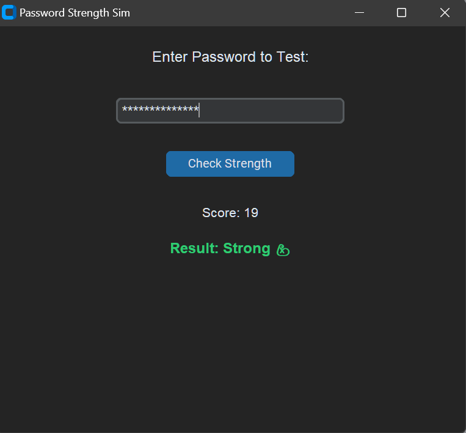

# ✨ Password Strength Simulator


A lightweight, modern, and password analysis tool built with Python, NumPy, and CustomTkinter. This project demonstrates how to use vectorized math to score password security and log audit data in real-time.

---

# 🚀 Features
## Vectorized Scoring: 
Uses NumPy's np.clip and np.select for lightning-fast character analysis.

## Modern GUI: 
A sleek, Dark Mode interface powered by CustomTkinter.

## Real-time Feedback: 
Dynamic color-coded results (Strong 💪, Moderate 😁, Weak 😟).

## Security Logging: 
Automatically generates a Password_log.log file to track audit history (without saving the actual passwords for safety!).

## Regex Integration: 
Detailed checks for digits, special characters, and uppercase letters.

---

# Screenshots




---

# 🛠️ Installation
Clone the repository:

```Bash
git clone https://github.com/reory/password-strength-sim.git
cd password-strength-sim
```
## Install dependencies:

```Bash
pip install numpy customtkinter
```
## Run the app:

```Bash
python gui.py
```

---

# 🧠 How It Works (The NumPy Logic)
This app doesn't just use standard Python loops. It treats password metrics as data arrays.

## Length Clipping: 
Uses $np.clip(length, 0, 12)$ to ensure length contributes a maximum of 12 points to the total score, preventing "length-padding" from tricking the system.

## Categorization: 
Uses $np.select(conditions, choices)$ to map numerical scores to human-readable labels instantly.

---

# 🗺️ Future Roadmap

- [ ] Common Password Blacklist: Use NumPy to cross-reference a database of 10,000+ leaked passwords.

- [ ] Entropy Meter: Implement a Shannon Entropy formula for scientific randomness scoring.

- [ ] Password Generator: A button to create high-entropy, randomized passwords.

- [ ] Data Visualization: A popup graph showing your password strength trends over time.

---

* **Built By Roy Peters** 😁 [](https://www.linkedin.com/in/roy-p-74980b382/)